<div align="center">
# Hi 👋, I'm Viveka Rentam

### Computer Science Engineering Student | AI & Generative AI Enthusiast | Full-Stack Developer

Building intelligent applications, AI agents, RAG systems, and practical software solutions.

<p>
  <a href="https://github.com/viveka-13">
    
  </a>
  <a href="https://www.linkedin.com/">
    
  </a>
</p>

</div>

---

## 👩‍💻 About Me

```python
viveka = {
    "education": "B.Tech - Computer Science Engineering",
    "college": "CMR Technical Campus, Hyderabad",
    "focus": [
        "Artificial Intelligence",
        "Generative AI",
        "Full-Stack Development",
        "Software Engineering"
    ],
    "languages": [
        "Java",
        "Python",
        "C",
        "JavaScript"
    ],
    "interests": [
        "AI/ML",
        "AI Agents",
        "RAG Systems",
        "Problem Solving",
        "Web Development"
    ],
    "currently_learning": [
        "Advanced DSA",
        "Generative AI",
        "AI Agent Development"
    ]
}
```

I am a Computer Science Engineering undergraduate passionate about building intelligent and useful software systems.

My interests span **Artificial Intelligence, Generative AI, Full-Stack Development, and Software Engineering**, with a strong focus on turning ideas into working applications.

I enjoy exploring **LLMs, AI agents, RAG pipelines, APIs, automation, and modern web technologies**, while continuously strengthening my fundamentals in computer science.

---

## Tech Arsenal

### 💻 Programming Languages

<p>

</p>

###  Frontend Development

<p>

</p>

###  Backend Development

<p>

</p>

###  AI & Generative AI

<p>

</p>

**LLMs · LangChain · LangGraph · RAG · AI Agents · Llama 3.1 · Ollama · Claude API**

###  Databases

**MySQL · SQLite · ChromaDB**

###  Tools & Platforms

<p>

</p>

---

##  Featured Projects

###  LaunchMind-AI — Autonomous Startup Generator

**Tech Stack:** Python · FastAPI · LangGraph · LangChain · Claude API · ChromaDB · SQLite

An AI-powered startup generator that transforms ideas into structured business plans using autonomous AI agents.

* Built multi-agent workflows for **market research, competitor analysis, and startup planning**.
* Implemented **RAG using ChromaDB**.
* Developed REST APIs for automated report generation.

---

###  AI-Powered Viva Agent

**Tech Stack:** Python · Flask · Ollama · Llama 3.1 · RAG · HTML · CSS · JavaScript

An AI-powered viva examination platform designed with separate faculty and student modules.

* Built document-based **RAG pipelines** for question generation and AI evaluation.
* Integrated **Speech-to-Text and Text-to-Speech** capabilities.
* Added performance reporting for evaluation and analysis.

---

###  Local Business Discovery Platform

**Tech Stack:** Node.js · React.js · JavaScript · Telegram Bot API · Discord Bot · Netlify

A platform focused on discovering local businesses and automating website generation workflows.

* Developed automation workflows for **business discovery and website generation**.
* Built interactive React interfaces.
* Integrated Telegram Bot workflows and automated deployment pipelines.

---

##  Core Computer Science

* Data Structures & Algorithms
* Object-Oriented Programming
* Database Management Systems
* Operating Systems
* Computer Networks
* Software Engineering

---

## 🏆 Achievements & Certifications

*  **2nd Prize** — College Idea Pitching Competition
*  Participated in **24-Hour & 8-Hour Hackathons**
*  **Oracle AI Foundations Associate**
*  **HackerEarth Python Certification**
*  Solved **219+ problems on LeetCode**
*  Solved **432+ problems on GeeksforGeeks**
*  Active **CodeChef** participant

---

## 📊 GitHub Statistics

<div align="center">




</div>

---

## 🔥 GitHub Streak

<div align="center">


</div>

---

## 🐍 Contribution Graph

<div align="center">


</div>

---

## 📫 Let's Connect

<div align="center">

<a href="https://github.com/viveka-13">

</a>

<a href="https://www.linkedin.com/">

</a>

</div>

---

<div align="center">

### 💡 Build. Learn. Solve. Repeat.

</div>
